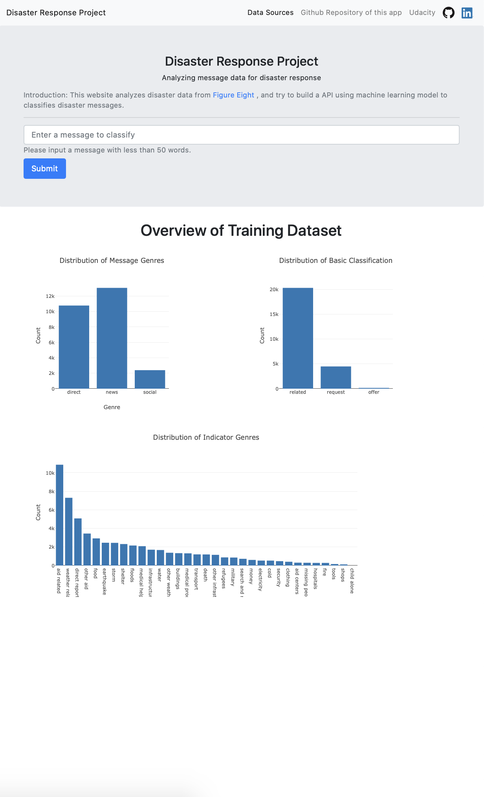
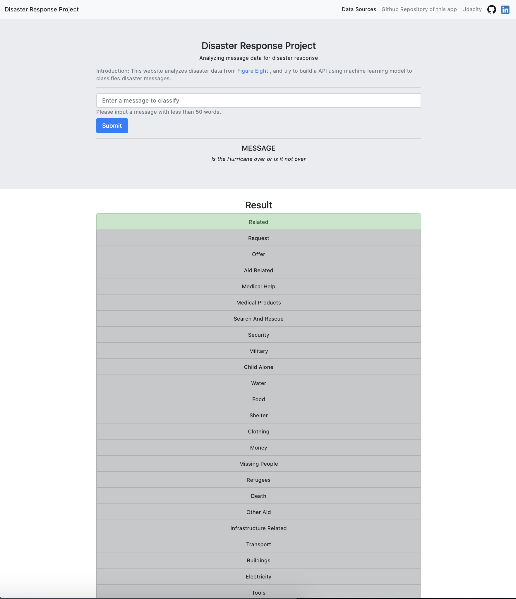

# Disaster_Response_Pipeline_project

## Table of Contents

1. [Installation](#installation)
2. [Project Motivation](#motivation)
3. [File Descriptions](#files)
4. [Limitations](#limitations)
5. [Licensing, Authors, and Acknowledgements](#licensing)

## Installation 

Besides the Anaconda distribution of Python, in order to run the machine learning web app, I used the following libraries:
- **plotly**, used for plot on html website, can be installed using `pip install plotly`
- **Flask**, used for manage the back end of the app, can be installed using `pip install Flask`
- The following libraries are needed: sklearn, nltk, sqlalchemy
- **Boostrap** is used for building the web app

## Project Motivation

For this project, I analyzed disaster data from [Figure Eight](https://www.figure-eight.com/) and build a model for an API that classifies disaster messages following the above steps:
[Figure Eight Disaster Dataset](https://www.figure-eight.com/dataset/combined-disaster-response-data/)
- Build a ETL pipeline to clean and prepare the data, and store the cleaned data into a database.

After cleaning, this dataset has 26216 rows ,40 columns, and 36 columns are features of the text.

- Builds a text processing and machine learning pipeline, trains and tunes a model using GridSearchCV and Exports the final model as a pickle file.

After trying KNeighborsClassifier, GaussianNB and RandomForestClassifier, I choose RandomForestClassifier. Fininally I have a f1 score of 0.9575

- Build a Flask Web App, use the saved machine learning model to classify new texts.

The app show like this:

## File Descriptions 

There are two notebooks(`ETL Pipeline Preparation.ipynb` and `ML Pipeline Preparation.ipynb` ) available here to showcase work related to the above two pipelines.  This notebooks is exploratory in searching through the data pertaining to the questions showcased by the notebook title.  Markdown cells were used to assist in walking through the thought process for individual steps.  

The `workspace` folder is used for build a local web app. Inside the `workspace` folder, `data` folder contains all datasets and ETL pipeline python file and the database. `models` folder contain ML pipeline python file. `app` folder contains all necessary html and python files to build the web app.

I used the randomforestcalssifier and get a f1 score more than 95.7%. But the pickle file of the model is too big (more than 6G) to upload, anyone use the file should run the `train_classifier.py` to get the pickle file.

## Limitations 

This project has following limitations:
- This dataset is imbalanced, for example features like aidor weather related text has thousands of count, but child alone, shops ect only has hunderds or tens of count. This imbalance may leads the model not trained well in these low count features.
The improvement ways maybe include find more data, or merge these feature with other.
- The f1 score is good besides `related` indicator, it only has a 0.287 recall score. 

## Licensing, Authors, Acknowledgements

Must give credit to figure eight for the dataset.  
The pipeline and web app files Referenced udacity data-engineer course.

Otherwise, this software is follow a MIT Licenec.

contact email: edifierxuhao123@gmail.com
